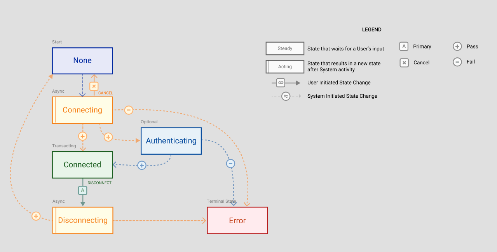

# SwiftWs

SwiftWs brings an easy-to-use wrapper around `URLSessionWebSocketTask` written in Swift. It includes support for HTTP headers and an extra state if an optional token is passed. The library provides delegates for state changes and data arrival, and includes methods for sending messages and disconnecting.

- Uses a state machine pattern mirroring to `URLSessionWebSocketTask` states
- Supports HTTP headers during initial token for additional parameters
- Provides updates on state changes
- Handles data arrival notifications
- Includes methods to send messages and disconnect
- Has a simple test to show basic usage

## Documentation

For detailed documentation, please visit [SwiftWs Documentation](https://helperbug.github.io/swift-ws/documentation/swiftws/).

## Web Socket States

## License

SwiftWs is released under the MIT License. See [MIT License](https://opensource.org/licenses/MIT) for details.
